# 🧭 Vue2 → Vue3 전환 요약 (E01 ~ E12)

## 📘 개요  
이 프로젝트는 Vue 2 기반 예제(`E01~E12`)를 Vue 3 문법으로 전환하며,  
Options API에서 Composition API로의 변화,  
그리고 Vue 3에서 추가된 기능(`ref`, `reactive`, `defineProps`, `defineEmits`, `onMounted` 등)을 실습한 기록이다.

---

## ⚙️ 주요 변화 요약

| 구분 | Vue 2 문법 | Vue 3 문법 |
|------|-------------|-------------|
| **컴포넌트 정의** | `export default { ... }` | `<script setup>` 또는 `setup()` 내부에 로직 작성 |
| **데이터 선언** | `data() { return { count: 0 } }` | `const count = ref(0)` |
| **템플릿 접근** | `{{ count }}` / `this.count` | `{{ count }}` / `count.value` (JS 내부) |
| **메서드 정의** | `methods: { greet() { ... } }` | `function greet() { ... }` (setup 안에서) |
| **계산된 속성** | `computed: { fullName() { ... } }` | `const fullName = computed(() => ...)` |
| **감시자 (watch)** | `watch: { count(new, old) { ... } }` | `watch(count, (newVal, oldVal) => { ... })` |
| **props 수신** | `props: ['message']` | `const props = defineProps(['message'])` |
| **emit 이벤트** | `this.$emit('send', data)` | `const emit = defineEmits(['send']); emit('send', data)` |
| **라이프사이클 훅** | `mounted()`, `updated()` 등 | `onMounted()`, `onUpdated()` 등 함수형으로 변경 |
| **provide/inject** | `provide()`, `inject()` (객체형) | `provide('key', value)` / `inject('key')` |
| **v-model** | props + emit 직접 연결 | 자동으로 `modelValue` / `update:modelValue` 매핑 |
| **this** | 데이터 접근 시 `this.` 필요 | `setup()` 안에서는 `this` 사용 불가 |
| **전역 API** | `Vue.use()`, `Vue.component()` | `app.use()`, `app.component()` |

---

## 🧩 실습별 전환 포인트

| 예제 | 주요 변경 내용 |
|------|----------------|
| **E01** | `data()` → `ref()`로 데이터 정의 |
| **E02** | `mounted()` → `onMounted()`로 변경, 반응형 값 갱신 `ref` 적용 |
| **E03** | `v-model`과 버튼 클릭 이벤트를 `ref` + 함수형 구조로 변경 |
| **E04** | `v-if`, `v-for`, `v-show` 등 지시어는 동일하지만, `data()` → `ref()` 기반으로 변경 |
| **E05** | `$emit` → `defineEmits()`, `props` → `defineProps()` |
| **E06** | `provide()` / `inject()` → Composition API 함수형으로 전환 |
| **E07** | Options API (Vue2 스타일) 유지 — 비교용 |
| **E08** | Composition API 완전 적용 — Vue3 핵심 구조 |
| **E09** | Provide/Inject, Composable 함수, Pinia 등 Vue3 확장 문법 실습 |
| **E10~E12** | Vue3 고급 문법 (Teleport, Suspense, 전역 상태 관리 등) |

---

## 📸 실행 결과 (E01 ~ E12)

아래는 각 예제의 Vue3 전환 후 실행 화면입니다.

| 예제 | 실행 화면 |
|------|------------|
| **E01** | 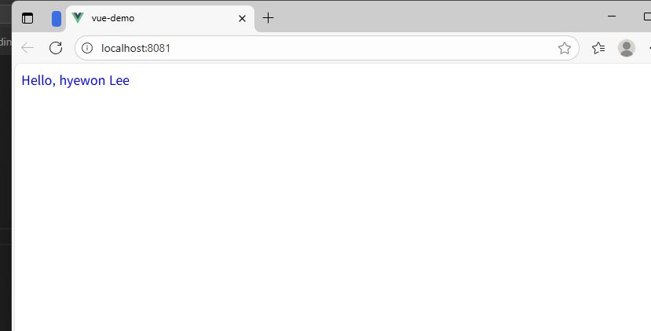 |
| **E02** | 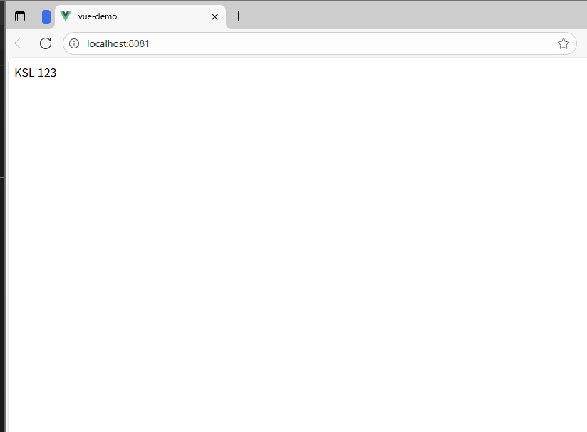 |
| **E03** | 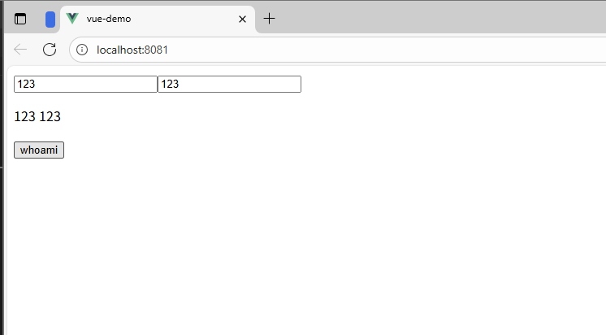 |
| **E04** | 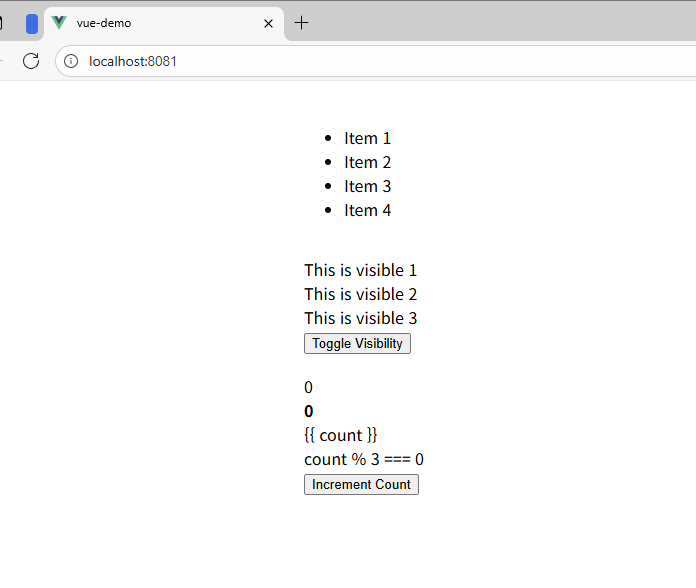 |
| **E05** | 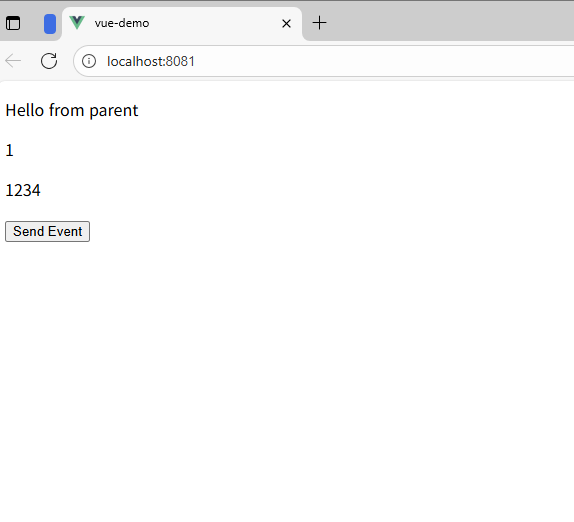 |
| **E06** | 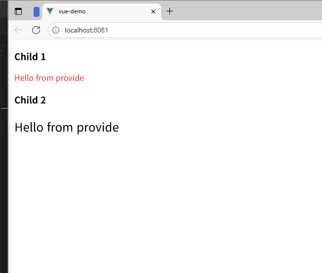 |
| **E07** | 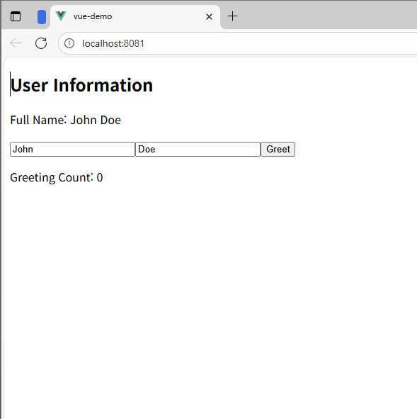 |
| **E08** | 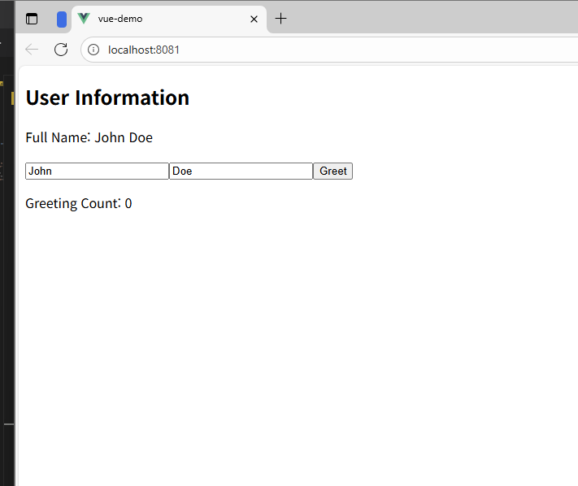 |
| **E09** | 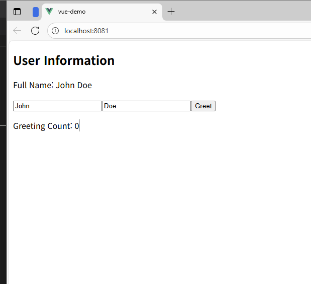 |
| **E10** | 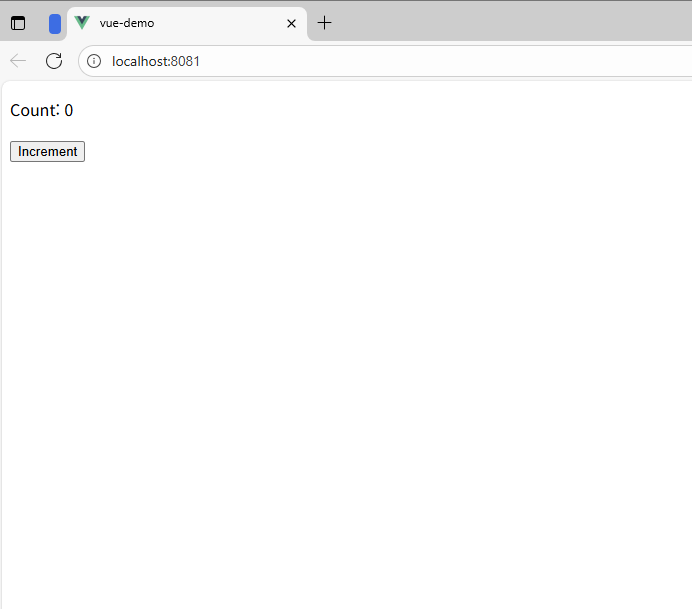 |
| **E11** | 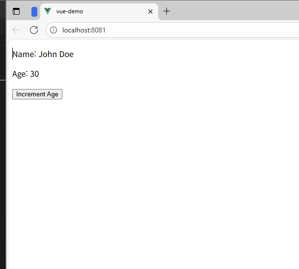 |
| **E12** | 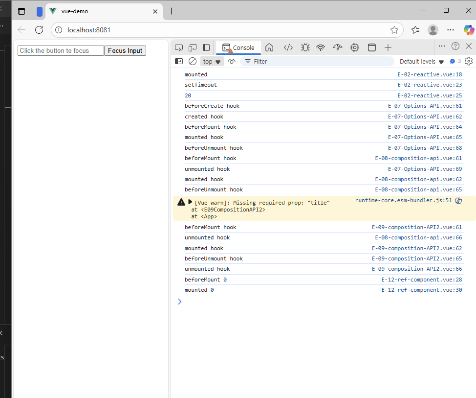 |

---